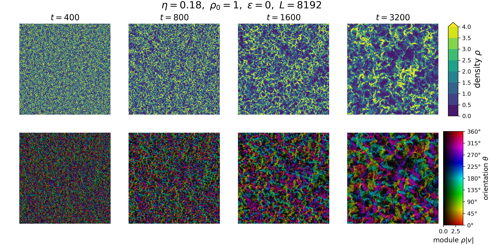

# Snapshot

## Read snapshot
Use class `RawSnap` to read the binary file recording `x, y, theta` (float32) of each particle.

Use class `CoarseGrainSnap` to read the binary file recording the coarse-grained field `num, vx, vy`.
## Plot density and velocity fields
Plot the coarse-grained density and velocity fields, such like

